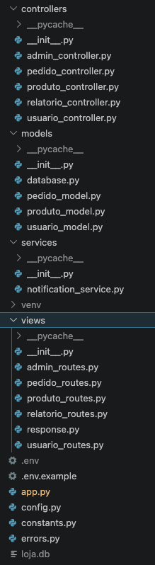
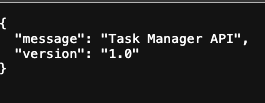

## A. Análise Manual

###  Projeto: Code-smells-project:
*   **CRITICAL:**
    - Secret_key chumbadas no código gerando vulnerabilidade para o projeto. **Justificativa:** Gera vulnerabilidade para o projeto sendo assim facilitando a qualquer pessoa conseguir as credenciais, tendo fácil acesso ao projeto.
    **MEDIUM:**
    - Tratamento de erros duplicados, try/exception repetidos. **Justificativa:** Dificulta entendimento de cada erro, para caso necessário identificar um problema ou efetuar uma manutenção.
    - Mistura de responsabilidades nas classes. **Justificativa:** Em arquitetura de software é imprescindível que cada camada tenha sua e específica responsabilidade a fim de facilitar manutenção do código e testes unitários.
    **LOW:**
    - Magic strings/numbers chumbadas. **Justificativa:** Caso seja necessário alterar um dado que é utilizado em várias chamadas de funções da classe fica muito mais fácil a alteração em apenas uma variável ao invés de alterar em todos os pontos do código.
    - Utilização de prints ao invés de built-in com logs da linguagem. **Justificativa:** Logs da linguagem ferecem níveis de gravidade (como erro ou aviso), permitem redirecionar saídas para arquivos ou servidores facilmente.

###  Projeto: Ecommerce-api-legacy:
*   **CRITICAL:**
    - Secret_key chumbadas no código gerando vulnerabilidade para o projeto. **Justificativa:** Gera vulnerabilidade para o projeto sendo assim facilitando a qualquer pessoa conseguir as credenciais tem fácil acesso ao projeto.
    **HIGH:**
    - Invocação de método assíncrono de forma síncrona. **Justificativa:** Risco grande de gerar um travamento (Deadlocks) na aplicação além disso piora o desempenho da aplicação e esconde erros importantes que dificultam a correção de bugs.
    **MEDIUM:**
    - Mistura de responsabilidades nas classes. **Justificativa:** Em arquitetura de software é imprescindível que cada camada tenha sua e específica responsabilidade a fim de facilitar manutenção do código e testes unitários.
    **LOW:**
    - Nomenclatura de variáveis com apenas uma letra. **Justificativa:** Ilegibilidade de código, dificultando também a manutenção.
    - Imports não utilizados. **Justificativa:** Popuição no código, causando também lentidão na aplicação porque o sistema vai precisar ler o import que está chamando outra classe por exemplo.

  ###  Projeto: Task-manager-api:
*   **CRITICAL:**
    - Dados sensíveis chumbadas no código gerando vulnerabilidade para o projeto. **Justificativa:** Gera vulnerabilidade para o projeto sendo assim facilitando a qualquer pessoa conseguir as credenciais tem fácil acesso ao projeto.
    **MEDIUM:**
    - Tratamento de erros duplicados, try/exception repetidos. **Justificativa:** Dificulta entendimento de cada erro, para caso necessário identificar um problema ou efetuar uma manutenção.
    **MEDIUM:**
    - God Class, centralização de muitas responsabilidades nas classes. **Justificativa:** Em arquitetura de software é imprescindível que cada camada tenha sua e específica responsabilidade a fim de facilitar manutenção do código e testes unitários.
    **LOW:**
    - Magic strings/numbers chumbadas. **Justificativa:** Caso seja necessário alterar um dado que é utilizado em várias chamadas de funções da classe fica muito mais fácil a alteração em apenas uma variável ao invés de alterar em todos os pontos do código.
    - Imports não utilizados. **Justificativa:** Popuição no código, causando também lentidão na aplicação porque o sistema vai precisar ler o import que está chamando outra classe por exemplo.

---

## B. Construção da Skill

### Decisões de Design
*  Skill construída com base em técnicas avançadas de prompt engineering, como: Role Prompting, Few-shot learn, chain of thought e skeleton of thought. Role Prompting, Few-shot learn e chain of thought usei para criar a skill de orquestração definindo Persona e escopo, few-shot com exemplos de acionamento dos arquivos de referência e chain of thought com a técnica `<thinking>` forçando assim o agente a raciocinar passo a passo antes de executar todas as fases garantindo que o agente não pule nenhuma fase. Para a skill de auditoria utilizei a técnica Skeleton of Thought com `<thinking>` forçando também o agente a criar um esqueleto mental antes de gerar o relatório final. Para a skill de refactor do projeto utilizei as técnicas Chain of Thought com  `<thinking>` forçando assim o agente a raciocinar passo a passo antes de modificar as pastas e arquivos para garantir que não haja nenhuma duplicidade de arquivos e que as dependências sejam inseridas nos arquivos corretos.

### Seleção de Anti-patterns

Anti-patterns incluídos:
1. **Hardcoded Secrets & Configs:**
 - Anti-pattern que gera um grande risco de segurança para a aplicação.
2. **God Class / Monolithic Entrypoint:** 
 - Gera ilegibilidade, dificulta testes unitários.
3. **Fat Controllers / Logic in View:** 
 - Infringe regras de responsabilidade das camadas em arquitetura de software
4. **Tight Coupling (Forte Acoplamento):** 
 - Infringe os princípios de SOLID, tornando também dificil manutenção, dificuldade em testes unitários
5. **Sync-over-Async:** 
 - Causa Esgotamento do Thread Pool, Deadlocks, queda de performance
6. **N+1 Query Problem / Inefficient Loops:** 
 -  Tratamento essencial porque ele degrada drasticamente a performance, multiplica o consumo de recursos do banco de dados e impede a escala da aplicação em ambiente de produção.
7. **Swallowed Exceptions / Duplicated Error Handling:** 
 - Tratamento fundamental para evitar falhas silenciosas, perda de dados e manutenções complexas.
8. **Deprecated/Unsafe APIs:** 
 - Acumula dívida técnica, abre brechas críticas de segurança e paralisa a evolução do sistema
9. **Magic Numbers / Magic Strings:** 
 - Dificultam a leitura do código, espalham valores sem contexto e tornam a manutenção difícil.
10. **Nomenclatura de Variáveis inconsistentes:** 
 - Deve ser tratado porque prejudica a legibilidade do código, dificulta a manutenção, gera bugs e diminui a produtividade da equipe.
11. **Imports desnecessários:** 
 - Dificultam a leitura e a manutenção, aumentam levemente o tempo de compilação do sistema.

### Agnosticismo de Tecnologia
A skill foi projetada para ser **agnóstica de linguagem**. 
*   **Como garanti isso:** Na construção da skill estou passando ao agente vários exemplos genéricos de códigos de linguagens diferentes garantiando assim que não é para se basear em apenas uma linguagem de programação. Também referenciei a linguagem de programação identificada na skill project-analysis como base para executar o refactor, portanto a fase 1 está diretamente ligada a fase 3.

### Desafios Encontrados
  - Na primeira iteração o modelo gerou várias pastas e arquivos duplicados, gerando vários conflitos no start da aplicação, tive que alterar novamente a SKILL adicionando instruções mais claras e técnica de CoT, para que isso seja evitado.
  - Identificação de todos os anti-patterns de cada projeto, para depois escreve-los nos arquivos de referência pensando nas melhores técnicas de prompt engineer para que o modelo execute as tarefas com precisão.

---

## C. Resultados

### 1. Resumo dos Relatórios de Auditoria

**ARCHITECTURE AUDIT REPORT**
- Project: code-smells-project
- Stack:   Python 3 + Flask 3.1.1 (flask-cors 5.0.1), SQLite (sqlite3 stdlib)
- Files:   4 analyzed | ~780 estimated lines of code

## Summary
CRITICAL: 4 | HIGH: 2 | MEDIUM: 3 | LOW: 4

---

**ARCHITECTURE AUDIT REPORT**
- Project: ecommerce-api-legacy
- Stack:   Node.js + Express.js (sqlite3)
- Files:   3 analyzed | ~150 estimated lines of code

## Summary
CRITICAL: 2 | HIGH: 3 | MEDIUM: 3 | LOW: 2

---

**ARCHITECTURE AUDIT REPORT**
- Project: task-manager-api
- Stack:   Python 3.11 + Flask 3.0 (Blueprints) + Flask-SQLAlchemy
- Files:   15 analyzed | ~1170 estimated lines of code

## Summary
CRITICAL: 2 | HIGH: 2 | MEDIUM: 3 | LOW: 3

### 2. Comparação Antes/Depois

**Project: code-smells-project**
## Antes e Depois

| Antes do refactor | Depois do refactor |
|:---:|:---:|
|  |  |

---

**Project: ecommerce-api-legacy**
## Antes e Depois

| Antes do refactor | Depois do refactor |
|:---:|:---:|
|  |  |

---

**Project: task-manager-api**
## Antes e Depois

| Antes do refactor | Depois do refactor |
|:---:|:---:|
|  |  |

### 3. Checklist de validação preenchido

**Project: code-smells-project**
## Validação:
- `venv/bin/python -c "import app"` — importação limpa.
- Boot real (`venv/bin/python app.py`) — subiu sem erros em http://localhost:5050, log estruturado confirmando inicialização do banco.
- Testado via curl: GET /, /health, /produtos/1, /produtos/9999 (404), /usuarios; POST /login (sucesso e falha), /pedidos; GET /pedidos, /relatorios/vendas; POST /admin/query (404, confirmando remoção); POST /admin/reset-db — todos responderam com status/payload esperados.
- Confirmado nos logs: notificações e reset de admin passam por `logging`, não `print`.
- Ambiente de teste limpo após validação (loja.db e log temporário removidos).

---

**Project: ecommerce-api-legacy**
## Validação:
- `npm install` → 1 pacote novo (bcryptjs) instalado com sucesso, sem erros de build.
- `npm start` → boot limpo, log: "Banco de dados inicializado com sucesso." + "Frankenstein LMS rodando e pronto na porta 3000...".
- Requisições de `api.http` testadas via curl, mesmos endpoints/portas/payloads da versão original:
  - POST /api/checkout (novo usuário, cartão Visa) → 200 {"msg":"Sucesso","enrollment_id":2}
  - POST /api/checkout (cartão não-Visa) → 400 "Pagamento recusado"
  - POST /api/checkout (payload incompleto) → 400 "Bad Request"
  - POST /api/checkout (curso inexistente) → 404 "Curso não encontrado"
  - GET /api/admin/financial-report → 200, valores agregados corretos (via JOIN, sem N+1)
  - DELETE /api/users/1 → 200 "Usuário deletado, mas as matrículas e pagamentos ficaram sujos no banco."
  - GET /api/admin/financial-report (após delete) → "Unknown" corretamente reportado para matrícula órfã, sem crash
- Nenhuma regressão de contrato externo (mesmas rotas, mesmos status codes, mesmos formatos de payload).

---

**Project: task-manager-api**
## Validação:
- `venv/bin/python seed.py` → "Seed concluído com sucesso! 3 usuários / 4 categorias / 10 tasks" (senha agora hasheada via werkzeug)
- `venv/bin/python app.py` → boot limpo em http://127.0.0.1:5051, sem erros de import/sintaxe
- Endpoints testados via curl, cobrindo os 3 domínios (tasks, users, reports/categories):
  - GET /health → 200
  - GET /tasks → 200, com overdue/user_name/category_name corretos via eager loading (sem N+1)
  - GET /tasks/1 → 200; GET /tasks/9999 → 404 "Task não encontrada"
  - POST /tasks (título curto) → 400 "Título muito curto"; POST /tasks (válido) → 201
  - GET /tasks/search?status=pending → 200; GET /tasks/stats → 200
  - POST /users (email inválido) → 400 "Email inválido"
  - POST /login (senha certa) → 200 com token fake; POST /login (senha errada) → 401 "Credenciais inválidas" (hash MD5→werkzeug validado)
  - GET /users, GET /users/1/tasks → 200
  - DELETE /users/2 → 200 "Usuário deletado com sucesso", com cascade de tasks confirmado (GET /tasks não retorna mais tasks do user 2)
  - GET /reports/summary → 200, user_productivity correto após a exclusão em cascata (2 queries totais, sem N+1)
  - GET /reports/user/1 → 200; GET /categories → 200
  - GET /rota-que-nao-existe → 404 HTML nativo do Flask preservado (confirma que o error handler global não interceptou HTTPException)
- Nenhuma regressão de contrato externo (mesmas rotas, mesmos status codes, mesmos formatos de payload; porta 5051 mantida).

### 4. Screenshots ou logs das aplicações rodando após refatoração.

| **Project: code-smells-project**
|:---:
|  |

---

| **Project: ecommerce-api-legacy**
|:---:
|  |

---

| **Project: task-manager-api**
|:---:
|  |

## D. Como executar

**Pré-requisitos:**
- ter uma conta Claude - subscription

- instale as dependências de cada projeto, exemplo:
**code-smells-project e task-manager-api:**
- python3 -m venv venv (instalar o ambiente virtual isolado para o projeto)
- source venv/bin/activate
- pip install flask (para task-manager-api)
- pip install -r requirements.txt
- pip freeze > requirements.txt
- python3 app.py

**ecommerce-api-legacy:**
- com o node instalado
- npm install (rodar no mesmo diretório do arquivo package.json)
- npm start

**Comandos para executar a Skill em cada projeto:**
> **via Terminal:**
- acesse o projeto via terminal e ative a sessão do claude 
  > cd {pasta do projeto} && claude (ex: cd code-smells-project && claude)
- rodar comando para auditoria e refactor: /refactor-arch

**Como validar o funcionamento:**
- rode o comando no claude code `/refactor-arch`, conforme instruções acima, e veja o arquivo audit-project.md na pasta `/reports`, no arquivo de cada projeto deverá conter 0 findings, isso prova o funcionamento correto da SKILL.